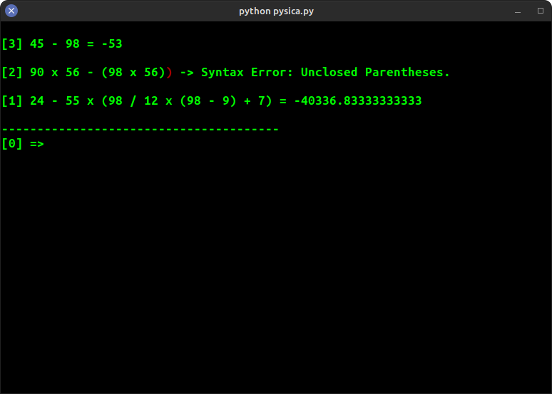

## Python Simple Calculator - PySiCa




This is a basic calculator made in python.

### Requirements
It requires only one external python package named termcolor which could be installed using:

```bash
pip install termcolor
```

### Running it
To run the app, use the following command on the root directory of the program:
```bash
python3 pysica.py
```

<!--TODO: add usage, and how it works-->

### About

I firstly made this program as an exercise when studying in the [CS50](https://www.edx.org/course/introduction-computer-science-harvardx-cs50x) and since then I made a lot of changes.
The most recent update I have made is the use of a "Pushdown Automata" to recognize which "sentences" (the user input) should be "accepted" and which should be "rejected", before parsing it to an expression. The Automata used is still on development, so, it could break on some expressions e.g. '**()9 - +**'.
