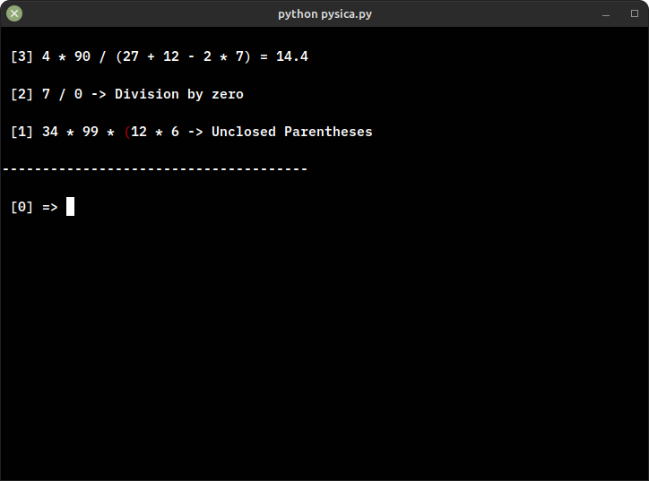

## Python Simple Calculator - PySiCa




A basic calculator made in python.

### Requirements
The requirements can be installed using the following command:

```bash
pip install -r requirements.txt
```

### Running it
To run the app, use the following command on the root directory of the program:
```bash
python3 pysica.py
```

<!--TODO: add usage, and how it works-->

### About

I firstly made this program as an exercise when studying in the [CS50](https://www.edx.org/course/introduction-computer-science-harvardx-cs50x), since then I made a lot of changes.
The most recent update I made, is using a "Pushdown Automata" to analyse which "sentences" (the user input) should be "accepted" and which should be "rejected", before parsing it to an expression. The Automata used is still on development, so, it could break on some expressions e.g. '**()9 - +**'.
